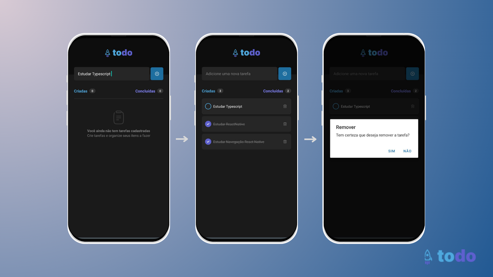

# :sparkles: todo-list

<br>

<div>
  
<div>

## :dart: Sobre

Primeiro desafio realizado da Trilha de React Native da RocketSeat. Aqui foram aplicados e estudados os seguintes conceitos:

- Estados
- Imutabilidade do estado
- Listas e chaves no React Native
- Propriedades
- Componentização

## 🧙‍♂️ Começando

Para rodar essa aplicação, você precisa ter o [Node](https://nodejs.org/en) instalado em sua máquina e o [Expo](https://play.google.com/store/apps/details?id=host.exp.exponent&hl=pt_BR&gl=US) instalado em seu celular. Com ambos instalados e preparados, em seu terminal, execute:

Clone o repositório

```shell
git clone https://github.com/ingridsj/todo-list.git
```

Instale as dependências

```shell

yarn

```

Execute o comando

```shell

yarn start

```

Pronto! Você conseguiu rodar a aplicação.

## :fire: Task list

- [x] Adicionar uma nova tarefa

- [x] Marcar e desmarcar uma tarefa como concluída

- [x] Remover uma tarefa da listagem

- [x] Mostrar o progresso de conclusão das tarefa

#### Adicionais

- [ ] Edição da Tarefa
- [ ] Salvar no AsyncStorage